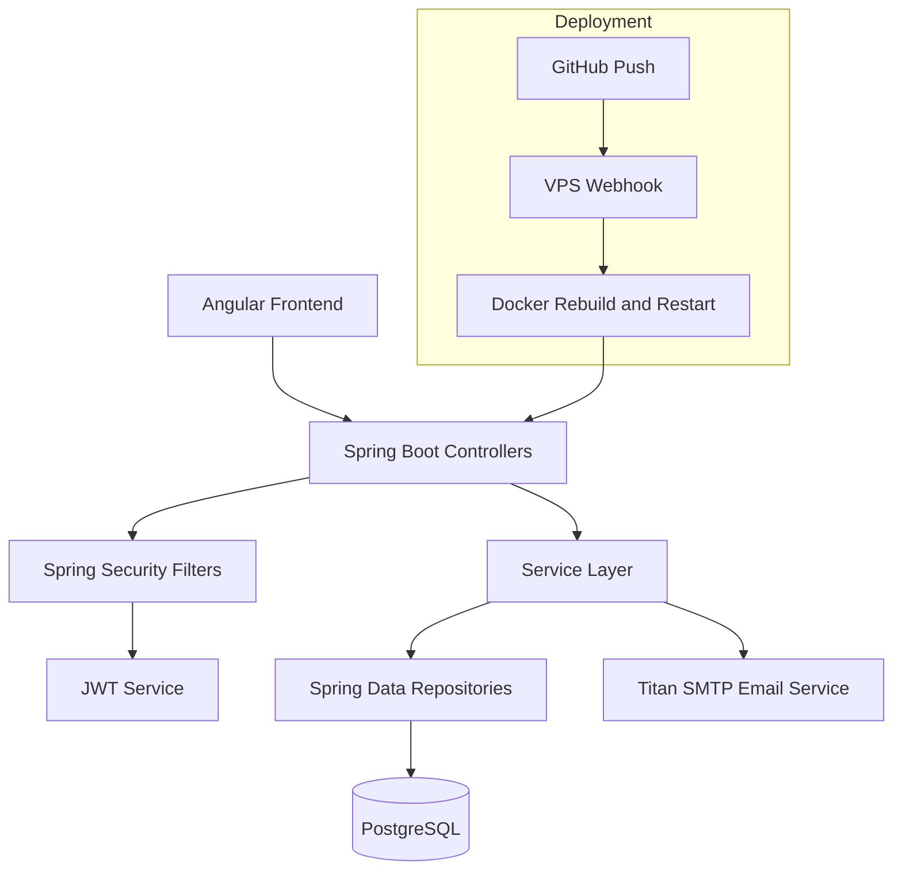
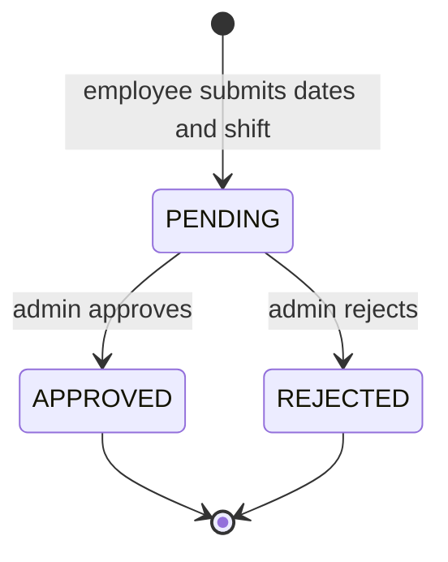
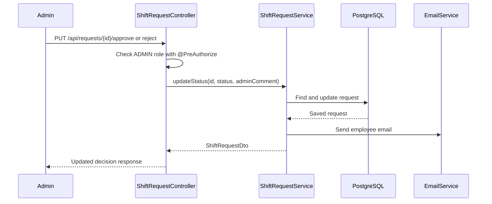
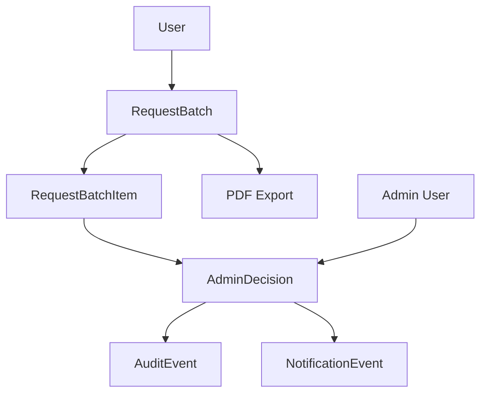

# Shift Scheduler App Backend

## Plain-English Overview

Shift Scheduler App is a full-stack scheduling platform built to replace a manual
"Request for Hours" paper workflow.

Employees use the frontend to request specific work dates and shifts. Administrators
use the admin dashboard to review those requests, approve or reject them, add notes,
and export request data.

This repository contains the Spring Boot backend. It is responsible for API
security, request validation, persistence, role enforcement, and notification hooks.

Related repositories:

- frontend: `https://github.com/skawuma/shiftApp-frontend`
- backend: `https://github.com/skawuma/Shift_App`

Live deployment:

- `https://schedule.samuelkawuma.com/login`

## Backend Responsibility

The backend is the source of truth for the shift request workflow.

It handles:

- JWT authentication
- role-based API authorization
- employee request submission
- admin request review
- duplicate request prevention
- request status changes
- admin comments
- PostgreSQL persistence
- email notification delivery
- production-safe schema configuration

## Why This Backend Exists

The original manual process used a signed "Request for Hours" form. A backend is
needed because the digital workflow must answer questions the paper process cannot
answer cleanly:

- who submitted the request?
- was the user allowed to submit it?
- which dates and shifts were requested?
- has this employee already requested the same date and shift?
- who is allowed to approve or reject?
- what decision was made?
- what notes were attached to that decision?
- how should the employee be notified?

## Current API Use Case Diagram

```mermaid
flowchart LR
    E[Employee] --> A[POST /api/auth/login]
    E --> B[POST /api/requests]
    E --> C[GET /api/requests/user]

    AD[Admin] --> D[POST /api/auth/login]
    AD --> F[GET /api/requests/admin]
    AD --> G[PUT /api/requests/{id}/approve]
    AD --> H[PUT /api/requests/{id}/reject]
    AD --> I[PUT /api/requests/{id}/status]

    B --> DB[(PostgreSQL)]
    G --> DB
    H --> DB
    G --> M[Email Notification]
    H --> M
```

## High-Level Architecture Diagram



## Core Backend Capabilities

### Authentication And Authorization

- username/password login
- JWT generation and validation
- Spring Security filter chain
- controller-level `@PreAuthorize` role checks
- employee endpoints protected for employee users
- admin endpoints protected for admin users

### Shift Request Workflow

- employees submit one request with one or more requested dates
- each request stores the selected shift
- new requests start as `PENDING`
- employees can load only their own requests through JWT-derived identity
- admins can list all requests with pagination and optional status filtering
- admins can approve, reject, or update request status

### Validation And Notifications

- request submission requires at least one date
- request submission requires a shift
- duplicate employee/date/shift requests are rejected
- status changes can include admin comments
- approval and rejection decisions trigger HTML email notification through the mail service

## Current Request Lifecycle



## Admin Decision Flow



## Package Layout

```text
src/main/java/com/skawuma/shiftapp/
|- config/
|  |- SecurityConfig.java
|  |- JwtAuthenticationFilter.java
|  `- AdminInitializer.java
|- controller/
|  |- AuthController.java
|  |- ShiftRequestController.java
|  |- EmployeeRequestController.java
|  `- HealthController.java
|- dto/
|- model/
|- repository/
|- service/
`- ShiftAppApplication.java
```

## Important Endpoints

### Authentication

- `POST /api/auth/login`
- `POST /api/auth/register`

### Employee Request APIs

- `POST /api/requests`
- `GET /api/requests/user`

### Admin Request APIs

- `GET /api/requests/admin`
- `PUT /api/requests/{id}/approve`
- `PUT /api/requests/{id}/reject`
- `PUT /api/requests/{id}/status`

### Legacy Employee Request APIs

- `POST /api/employee-requests`
- `GET /api/employee-requests`
- `PUT /api/employee-requests/{id}/status`

The legacy controller is mapped separately so it does not collide with the primary
`/api/requests` controller.

## Security Hardening Snapshot

Recent backend hardening work focused on production safety:

- duplicate controller mapping fixed
- backend role checks added with `@PreAuthorize`
- request APIs derive employee identity from JWT authentication instead of trusting a browser-supplied `userId`
- `spring.jpa.hibernate.ddl-auto` moved away from `create-drop`
- active profile defaults to `prod`
- JWT role prefix handling corrected for Spring Security role checks
- sensitive token logging removed from authentication flow

## Configuration

Required production environment variables:

- `DB_URL`
- `DB_USERNAME`
- `DB_PASSWORD`
- `JWT_SECRET`
- `ADMIN_USERNAME`
- `ADMIN_PASSWORD`

Mail configuration:

- `TITAN_EMAIL`
- `TITAN_PASSWORD`

Optional environment variables:

- `SPRING_PROFILES_ACTIVE` - defaults to `prod`
- `JPA_DDL_AUTO` - defaults to `update`

The main configuration file is:

- `src/main/resources/application.properties`

## Running Locally

```bash
./mvnw spring-boot:run
```

The API runs at:

- `http://localhost:8080`

## Tests

```bash
./mvnw test
```

## Docker

```bash
docker build -t shift-backend .
docker run -p 8080:8080 shift-backend
```

## PDF-Form Alignment Roadmap

The next product sprints should make the backend model match the original
"Request for Hours" form more closely:

- request batch entity with employee name, submitted date, mandatory hours, voluntary hours, and multiple row items
- request row entity for per-date and per-shift decisions
- decision states: `APPROVED_AS_REQUESTED`, `APPROVED_WITH_MODIFICATION`, and `DENIED_WITH_NOTES`
- admin-modified fields for approved shift, approved time, admin notes, and decision date
- shift template table or enum for `7am-3pm`, `3pm-11pm`, `3pm-9pm`, `11pm-7am`, and `11pm-9am`
- PDF/print export endpoint that recreates the signed paper form
- audit trail for submitted by, reviewed by, changed from/to, and timestamps
- notification events for approved, modified, and denied request rows

## Future-State Backend Direction



The backend can support the next few sprints as one Spring Boot application. If the
platform grows, notifications, audit reporting, and PDF generation can later become
separate modules or services.

## Suggested Demo Story

1. Explain the manual "Request for Hours" paper workflow.
2. Log in as an employee and submit requested dates plus a shift.
3. Log in as an admin and review pending requests.
4. Approve or reject with an admin comment.
5. Show the employee-visible status update and notification behavior.
6. Explain the request batch roadmap that will recreate the paper form digitally.

## Closing Summary

This backend turns a manual scheduling form into a secure, traceable API workflow.
It is intentionally practical: simple enough to deploy as one Spring Boot service,
strict enough to enforce role-based business rules, and ready to grow into batch
requests, per-row decisions, audit trails, PDF exports, and richer notifications.
